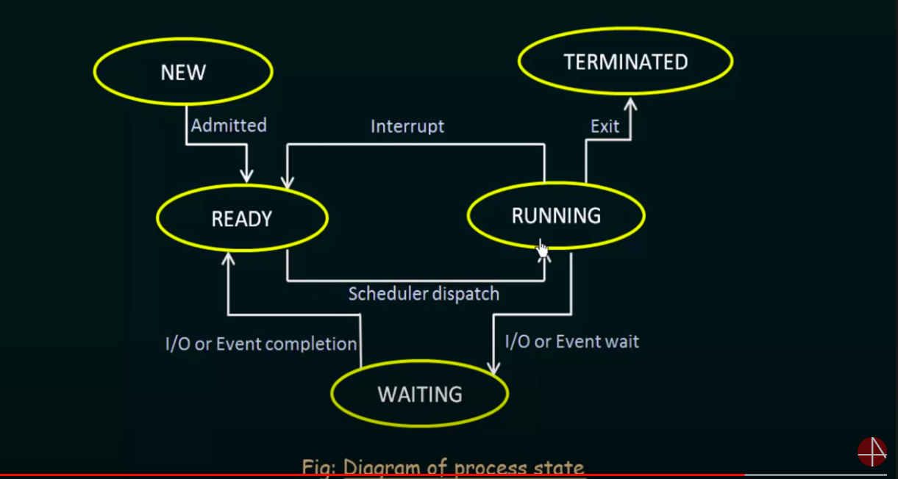

# System call
  -- todo --
# types of systems calls

- process control
    - end, abort 
    - load, execute
    - create/terminate process
    - get/set process attributes
    - wait for time
    - wait event, signal event
    - allocate and free memory

- file manipulation
    - create/delete file
    - open,close
    - read/write/reposition
    - get/set file attributes

- device management
    - request device, release device
    - read/write/reposition
    - get/set device attributes
    - logically attach/detach devices

- information maintenance
    - get/set time or date
    - get/set system data;
    - get process, file, device attributes
    - set process, file , device attributes

- communications
    - create/delete communication connection
    - send/receive messages
    - transfer status information
    - attach/detach remote devices

# system programs
    - file management
        - create/delete/copy/rename/
        - print/dump
        - list/manipulate files and directories
    - status information
        - date, time
        - amount of available memory
        - number of users
    - file modification
        - to modify inner content of files
    - programming lang support
        - compilers
        - assemblers
        - debuggers
        - interpreters
    - program loading and execution
        - handles loading and execution of a program
    
    - communication
        - creating virtual connection among processes/ users/ computer systems
        - allowing users to send messages to one anothers screesns
        - send electronica mails 
    - web browsers
        - depneds on os, edge,explorer .
    

users
------------
application programs
-------------
system programs
-------------
operating system
 ------| -----
computer hardware

# operating system design and implementation

- design goals
   - user goals
   - system goals

# user goals
    - easy to use and learn
    - convenient to use
    - reliable, safe & fast.
# systems goals
 - error free and efficient
 - easy to design and implement
 -  easy to maintain and operate

 #mechanisms and policies
  - mechanisms - how to do something
  - policies - rules 

  imp principle - is the separation of policy from mechanism;

> os are implemented by high level languages
  - benefilts
        - written faster
        - more compact
        - easier to understand and debug
        - easy to port
  ms-dos written in intel 8088 lang, supported only in intel cpus
  linux - in c, supported wide varaity of systems

  # structures of operating systems
    - simple structure

            Application Programs
            -----------------------
            Resident system programs
            --------------------
            Device drivers
            -------------------
            ROM BIOS device drivers
    - monolith structure
    - layered structure
        - because of layers there will be some delay, ui <-> hardware

    - micro kernels
        - services are available as systems prorgams
        - micro kernel establishes communication between the client programs <-> services direclty
        - majority runs in user mode

# modules kernel
 - core kernel
    - file systems
    - exe formats
    - stream modules
    - device and bus drives
    - scheduling classes
    - loadable system calls
    - misc modules

# virtual machines

# os generation & system boot

sysgen makes os for specific machine
    based on
        - kind of cpu
        - available memory
        - hardware

system boot
    - bootstrap loader loads the kernel
    - bootstrap program stored in ROM.

# process management

    - process
        - thread

# process state
    - current act of process
        - NEW - being create
        - RUNNING - being executed.
        - WAITING - waiting for some event to occur.
        - READY - waiting for processor

        - TERMINATED - process has finished execution

        
# process control block
    - process state
    - process number/id
    - program counter
    - registers
    - memory limits
    - list of open files
    - cpu scheduling information
    - memory management information
    - accounting information
        - memory used, cpu time used
    - IO information

# process scheduling
    
# scheduling queues

    - job queue
        holds the processes
    - ready queue
        - list of processes are in memory ready to be executed.

# context switch
  - switching from one process from one to another
  - cpu has to save the context;

  ***more context switches, overhead increases.*** no useful work while switching context.
  
# process creation
    - parent -> child - sub child process (a tree strcture)

- parent continues to execute concurent  with childs
- parent waits till some or all of childs have terminated

 - in terms of address space
  
# process termination

# inter process communication

    - independent processes
    - cooperating processes - shares resources among them.

    - two models of ipc
        - shared memory
        - message passing

# message passing systems
   - fixed size messages
   - variable size  - easy to program
    
    # communication links
        - direct/indirect
            - issue - naming
            - direct
                - send(p,message), receive(q, message);
                - send(p,message), receive(id, message); id is the sender process id
            - indirect
                - messages are transferred over the mailboxes, ie ports 
            
        - sync/async communication
            - issue - synchronization
        - automatic/ explicit buffering
            - buffering

